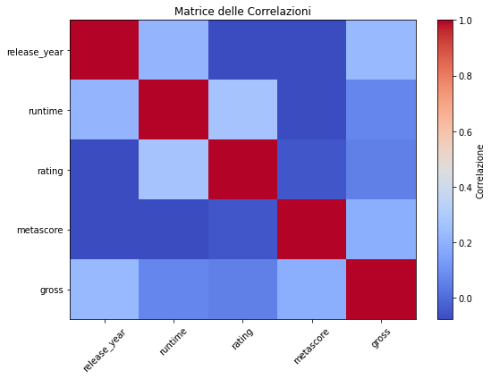

# IMDb Movie Data Analysis

Questo progetto è una semplice analisi esplorativa del dataset IMDb esercitarmi con le basi della Data Analysis in Python.

## Strumenti usati:
- Python
- Pandas
- NumPy
- Matplotlib

## Cosa contiene:

- Pulizia dati (colonne: `release_year`, `runtime`, `gross`)
- Statistiche descrittive (media, deviazione standard)
- Istogrammi su `rating`, `metascore`, `gross`
- Analisi delle correlazioni tra variabili numeriche
- Top 10 film per incasso

## Obiettivo

Mostrare le competenze fondamentali in Data Analysis: pulizia, visualizzazione, interpretazione e logica analitica.

## File

- `IMDb_analysis.ipynb`: il notebook con tutto il codice
- `README.md`: questa descrizione
- `imdb_raw`: dati grezzi scaricati da kaggle

## Esempio di visualizzazione

 **Grafico delle correlazioni**
## Film con maggiori incassi
- Star Wars: Episode VII - The Force Awakens
- Avengers: Endgame
- Spider-Man: No Way Home	

Il progetto è stato realizzato come esercizio personale di analisi dati.

~ Loris Manganiello
